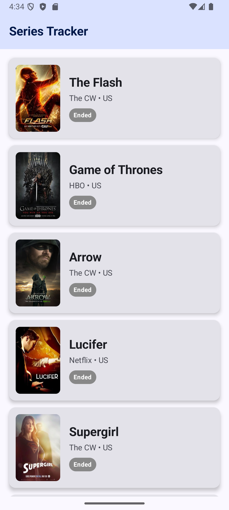
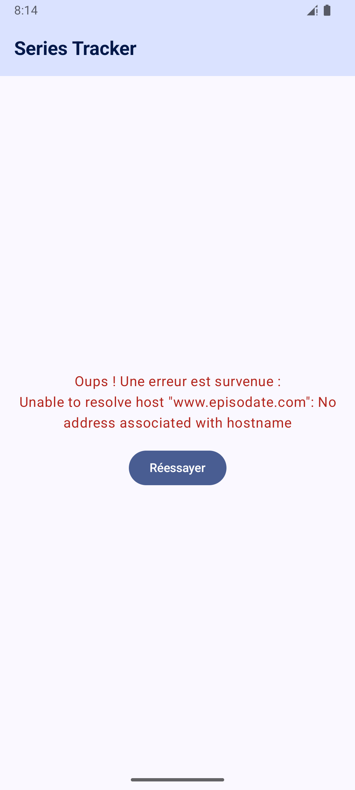

# SeriesTracker Android

**SeriesTracker** is a modern Android app built in Kotlin that lets you discover the most popular TV shows right now, powered by the EpisoDate API.

---

## App preview

The final result: a list of popular shows, plus graceful handling of network errors.

 

---

## Features

- Real-time fetching of the most popular TV shows via the EpisoDate API.
- Smooth list view showing each show's poster, broadcast network, and status (Running / Ended).
- Asynchronous image loading with caching.
- Robust UI state handling (loading indicator, data display, network error state with a retry button).
- 100% declarative UI.

---

## Tech stack & architecture

The app follows Google's recommended standards, using **MVVM** (Model-View-ViewModel) combined with **Clean Architecture** principles.

- **Language:** Kotlin
- **UI:** Jetpack Compose (Material 3)
- **Dependency injection:** Dagger-Hilt
- **Networking & API:** Retrofit2, OkHttp3 (Logging Interceptor), Gson
- **Image loading:** Coil
- **Async:** Coroutines & Kotlin Flow (`StateFlow`)

---

## Project structure

The code is organized by responsibility layer (feature/layer packaging):

```
SeriesTracker-Android/app/src/main/java/com/example/seriestracker/
│
├── data/           # Data layer
│   ├── mapper/     # DTO-to-model conversion
│   ├── remote/     # DTOs and Retrofit API interface
│   └── repository/ # TvShowRepository (single source of truth)
│
├── di/             # Dependency injection
│   └── NetworkModule  # Hilt provider for Retrofit and OkHttp
│
├── domain/         # Business layer
│   └── model/      # Clean data models (TvShow)
│
└── ui/             # Presentation layer
    ├── components/ # Reusable Compose components (ShowCard)
    ├── screens/    # Full screens (HomeScreen)
    ├── theme/      # Colors, typography (Material theme)
    └── viewmodel/  # PopularShowsViewModel and UiState management
```

---

## Getting started

### Requirements

- Android Studio (a recent version with Jetpack Compose support)
- Android SDK with `minSdk` 24 (Android 7.0) and `targetSdk` 36

### From source

1. Clone the repo:
   ```bash
   git clone https://github.com/Synergy-XVortex/SeriesTracker-Android.git
   ```
2. Open the project in Android Studio.
3. Let Gradle sync the dependencies.
4. Run the app on an emulator or a physical device.

### From the APK

A ready-to-install APK is available directly in this repo:

- Go to the `/apk` folder at the project root.
- Download and install `SeriesTracker-debug.apk`.

---

## Possible next steps

- Add a search bar to find a specific show.
- Save favorite shows to a local database (Room).
- Add a detail screen showing a selected show's synopsis.
- Dynamic pagination (infinite scrolling) to load more of the list while scrolling.

---

## Contributing

Contributions are welcome:

1. Fork the project
2. Create a branch (`feature/NewFeature`)
3. Commit your changes
4. Push and open a pull request

---

## Author

Developed by [Clément Vongsanga](https://github.com/Synergy-XVortex).
